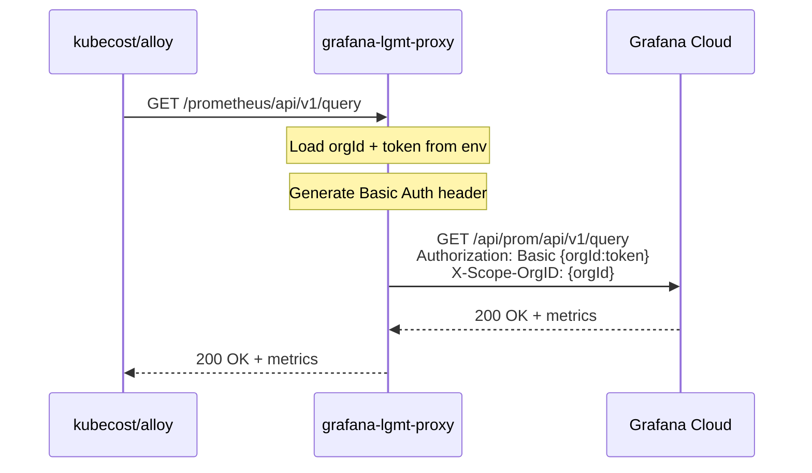

# Grafana LGMT Proxy

Lightweight reverse proxy for Grafana Cloud LGTM stack (Logs, Grafana, Traces, Metrics) with AWS Secrets Manager integration.

## Overview

This proxy intercepts requests to Grafana Cloud endpoints and injects authentication credentials from AWS Secrets Manager using `secrets-manager-go-v2`. It eliminates the need for Kubernetes secrets containing Grafana Cloud tokens.

```
                                    Kubernetes Cluster
┌──────────────────────────────────────────────────────────────────────────────┐
│                                                                              │
│  ┌─────────────────┐     ┌─────────────────────┐     ┌─────────────────┐   │
│  │ kubecost        │────▶│ grafana-lgmt-proxy  │────▶│ Grafana Cloud   │   │
│  │ observability-  │     │ (Fastify + auth     │     │ prometheus/loki │   │
│  │ agents / alloy  │     │  injection)         │     │ tempo/otlp      │   │
│  └─────────────────┘     └─────────────────────┘     └─────────────────┘   │
│                                    │                                         │
└────────────────────────────────────┼─────────────────────────────────────────┘
                                     │
                                     ▼
                           ┌─────────────────┐
                           │ AWS Secrets Mgr │
                           │ + KMS Decrypt   │
                           └─────────────────┘
```

## Architecture

### Components

| Component | File | Description |
|-----------|------|-------------|
| Entry point | `src/index.ts` | Loads config, starts server, handles shutdown |
| Server | `src/server.ts` | Fastify server with health, metrics, and proxy routes |
| Config | `src/config.ts` | Zod-validated config from environment variables |
| Proxy routes | `src/routes/proxy.ts` | Path-based routing to Grafana Cloud upstreams |
| Health | `src/routes/health.ts` | `/health` and `/ready` endpoints |
| Metrics | `src/routes/metrics.ts` | Prometheus metrics for proxy itself |

### Request Flow



## Supported Endpoints

| Proxy Path | Upstream Path | Service | Use Case |
|------------|---------------|---------|----------|
| `/api/prom/*` | `/api/prom/*` | Prometheus | Metrics remote write (observability-agents) |
| `/prometheus/*` | `/api/prom/*` | Prometheus | Query API (kubecost, dashboards) |
| `/loki/*` | `/loki/*` | Loki | Logs push and query |
| `/tempo/*` | `/tempo/*` | Tempo | Traces query |
| `/otlp/*` | `/otlp/*` | OTLP Gateway | OpenTelemetry (traces, metrics, logs) |

## Grafana Cloud Configuration

| Service | URL | Org ID |
|---------|-----|--------|
| Prometheus | `prometheus-prod-56-prod-us-east-2.grafana.net` | 2668285 |
| Loki | `logs-prod-036.grafana.net` | 1329819 |
| Tempo | `tempo-prod-26-prod-us-east-2.grafana.net` | 1324130 |
| OTLP | `otlp-gateway-prod-us-east-2.grafana.net` | 1372025 |

**Authentication format**: `Authorization: Basic base64({orgId}:{accessToken})` + `X-Scope-OrgID: {orgId}`

## Getting Started

### Prerequisites

- Node.js 20+
- pnpm 9+
- Docker (for container builds)
- AWS credentials (for ECR access during build)

### Local Development

```bash
# Install dependencies
pnpm install

# Copy and configure environment
cp .env.example .env
# Edit .env with your Grafana Cloud credentials

# Run in development mode
pnpm dev

# Run tests
pnpm test

# Lint and type check
pnpm lint
pnpm typecheck
```

### Docker Build

```bash
# Login to ECR (requires AWS credentials)
aws ecr get-login-password --region us-east-1 | \
  docker login --username AWS --password-stdin 534042329084.dkr.ecr.us-east-1.amazonaws.com

# Build
docker build -t grafana-lgmt-proxy:test \
  --build-arg DEPLOYMENT_ID=local \
  --build-arg GIT_COMMIT_SHA=local .

# Run
docker run -p 8085:8085 \
  -e GRAFANA_CLOUD_PROMETHEUS_URL=https://prometheus-prod-56-prod-us-east-2.grafana.net \
  -e GRAFANA_CLOUD_PROMETHEUS_ORG_ID=2668285 \
  -e GRAFANA_CLOUD_LOKI_URL=https://logs-prod-036.grafana.net \
  -e GRAFANA_CLOUD_LOKI_ORG_ID=1329819 \
  -e GRAFANA_CLOUD_TEMPO_URL=https://tempo-prod-26-prod-us-east-2.grafana.net \
  -e GRAFANA_CLOUD_TEMPO_ORG_ID=1324130 \
  -e GRAFANA_CLOUD_OTLP_URL=https://otlp-gateway-prod-us-east-2.grafana.net \
  -e GRAFANA_CLOUD_OTLP_ORG_ID=1372025 \
  -e GRAFANA_CLOUD_ACCESS_TOKEN=your_token_here \
  grafana-lgmt-proxy:test
```

### Test Endpoints

```bash
# Health check
curl http://localhost:8085/health

# Readiness check
curl http://localhost:8085/ready

# Prometheus metrics (proxy's own metrics)
curl http://localhost:8085/metrics

# Query Prometheus via proxy
curl 'http://localhost:8085/prometheus/api/v1/query?query=up'

# Query Loki labels
curl 'http://localhost:8085/loki/api/v1/labels'

# Search Tempo traces
curl 'http://localhost:8085/tempo/api/search?limit=10'
```

## Configuration

### Environment Variables

| Variable | Required | Description |
|----------|----------|-------------|
| `GRAFANA_CLOUD_PROMETHEUS_URL` | Yes | Prometheus/Mimir endpoint URL |
| `GRAFANA_CLOUD_PROMETHEUS_ORG_ID` | Yes | Prometheus org ID (username) |
| `GRAFANA_CLOUD_PROMETHEUS_TENANT_ID` | No | Override X-Scope-OrgID (defaults to org ID) |
| `GRAFANA_CLOUD_LOKI_URL` | Yes | Loki endpoint URL |
| `GRAFANA_CLOUD_LOKI_ORG_ID` | Yes | Loki org ID |
| `GRAFANA_CLOUD_LOKI_TENANT_ID` | No | Override X-Scope-OrgID |
| `GRAFANA_CLOUD_TEMPO_URL` | Yes | Tempo endpoint URL |
| `GRAFANA_CLOUD_TEMPO_ORG_ID` | Yes | Tempo org ID |
| `GRAFANA_CLOUD_TEMPO_TENANT_ID` | No | Override X-Scope-OrgID |
| `GRAFANA_CLOUD_OTLP_URL` | Yes | OTLP Gateway URL |
| `GRAFANA_CLOUD_OTLP_ORG_ID` | Yes | OTLP org ID |
| `GRAFANA_CLOUD_OTLP_TENANT_ID` | No | Override X-Scope-OrgID |
| `GRAFANA_CLOUD_ACCESS_TOKEN` | Yes | Grafana Cloud API token |
| `PORT` | No | Server port (default: 8085) |

### Secrets Management

In production, credentials are decrypted at startup using `secrets-manager-go`:

```bash
# In entrypoint.sh or Helm values
secrets-manager-go -- node dist/index.js
```

The binary:
1. Reads `encrypted_*` environment variables
2. Decrypts using AWS KMS (via IRSA)
3. Exports as regular environment variables
4. Executes the application

## Deployment

### Helm Chart

Located in `deployment/grafana-lgmt-proxy/`. Uses the shared deployment chart from S3.

```bash
# Template check
helm template grafana-lgmt-proxy ./deployment/grafana-lgmt-proxy

# Deploy to dev
helm upgrade --install grafana-lgmt-proxy ./deployment/grafana-lgmt-proxy \
  -f ./deployment/grafana-lgmt-proxy/values-dev.yaml \
  -n observability
```

### CI/CD

- **GitHub Actions** (`.github/workflows/docker-build.yml`): Builds and pushes to ECR on every push
- **GitLab CI** (`.gitlab-ci.yml`): Multi-arch builds (amd64/arm64) for production deployment

### Infrastructure Requirements

| Resource | Purpose |
|----------|---------|
| KMS CMK | Asymmetric RSA_4096 key for secrets encryption |
| IRSA | IAM role for service account to decrypt via KMS |
| ECR | Container registry (`observability/grafana-lgmt-proxy`) |

## Project Structure

```
grafana-lgmt-proxy/
├── src/
│   ├── index.ts              # Entry point
│   ├── server.ts             # Fastify server setup
│   ├── config.ts             # Configuration with Zod validation
│   ├── types.ts              # TypeScript types
│   └── routes/
│       ├── health.ts         # /health, /ready endpoints
│       ├── metrics.ts        # /metrics endpoint (prom-client)
│       └── proxy.ts          # Proxy routes to Grafana Cloud
├── src/__tests__/            # Vitest tests
├── deployment/
│   └── grafana-lgmt-proxy/
│       ├── Chart.yaml
│       ├── values.yaml       # Base values
│       └── values-{dev,stage,prod}.yaml
├── gitlab-templates/         # GitLab CI templates
├── Dockerfile
├── entrypoint.sh
├── docker-compose.yaml
└── docs/
    └── legacy/               # Historical planning docs
```

## Observability

### Metrics

The proxy exposes Prometheus metrics at `/metrics`:

| Metric | Type | Description |
|--------|------|-------------|
| `proxy_requests_total` | Counter | Total requests by upstream, method, status |
| `proxy_request_duration_seconds` | Histogram | Request duration by upstream, method |

### Health Checks

- `/health` - Liveness probe (always returns `{"status": "ok"}`)
- `/ready` - Readiness probe (always returns `{"status": "ok"}`)

### Logging

Structured JSON logging via Pino. Log level: `info`.

## Security

- No plaintext secrets in K8s or git
- Credentials decrypted at runtime via KMS
- IRSA for least-privilege AWS access
- Basic auth injected per-request (not stored in headers/logs)
- Read-only root filesystem in container

## Consumers

| Service | Use Case | Endpoint Used |
|---------|----------|---------------|
| observability-agents (Alloy) | Metrics push | `/api/prom/push` |
| observability-agents (Alloy) | OTLP traces | `/otlp/v1/traces` |
| kubecost/opencost | Metrics query | `/prometheus/api/v1/*` |

## Legacy Documentation

Historical planning documents are preserved in `docs/legacy/`:
- `PRD.md` - Original product requirements
- `AGENTS.md` - Original Claude Code instructions

These contain outdated endpoint URLs and implementation details. Use this README as the canonical reference.
