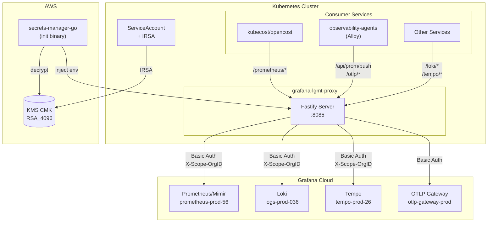
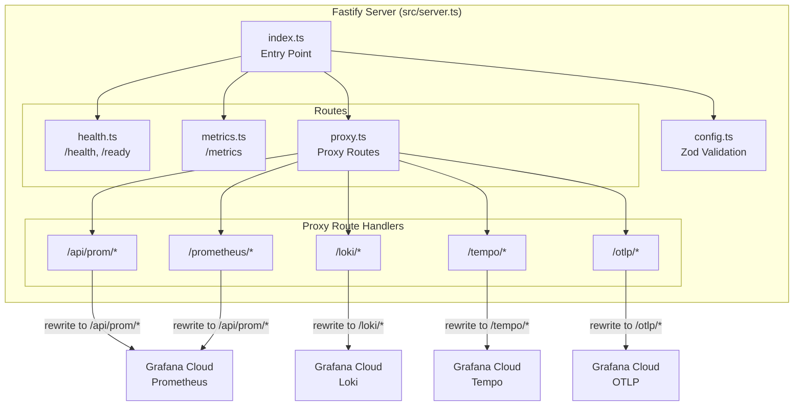
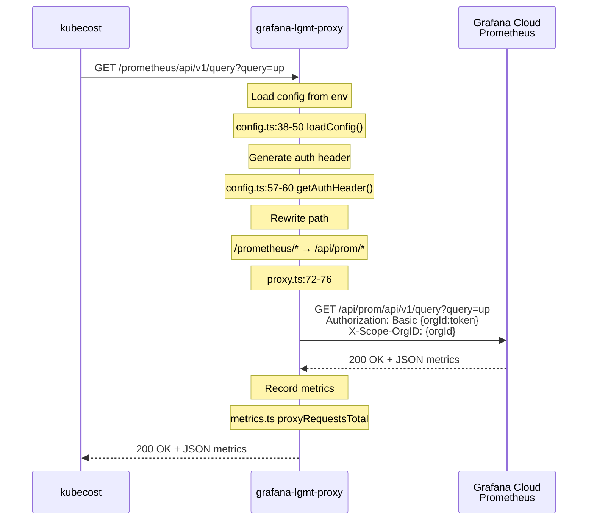
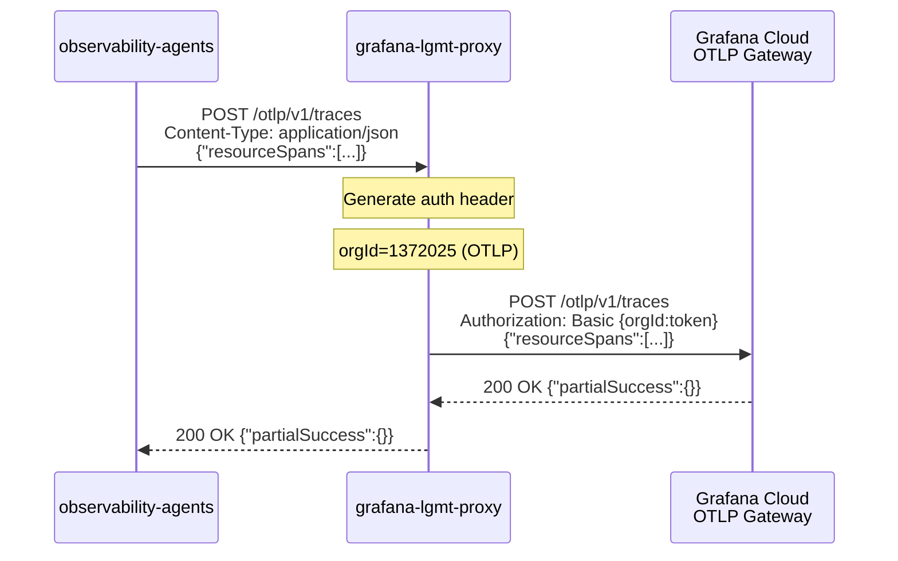
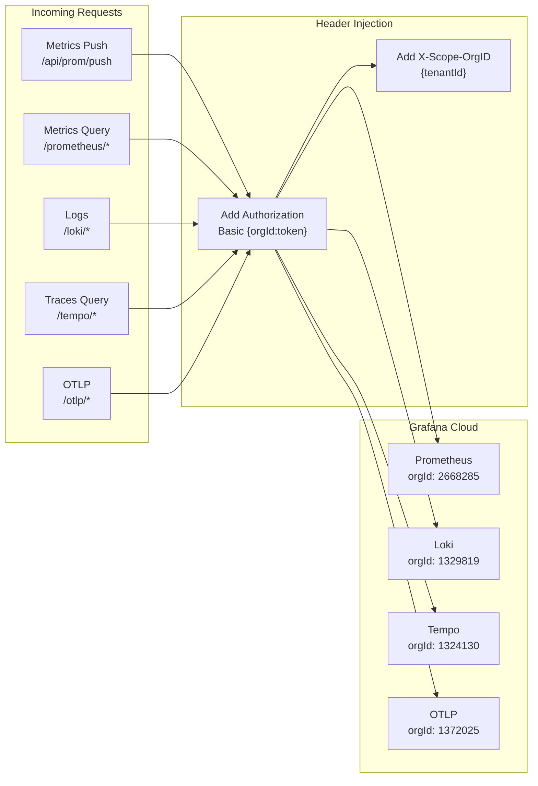

# Architecture

This document describes the architecture of grafana-lgmt-proxy using C4 diagrams and code anchors.

## C4 Container Diagram

High-level view showing the proxy in context with external systems.

## C4 Component Diagram

Internal components of the Fastify server.

## Code Anchors

| Component | File | Key Functions/Symbols |
|-----------|------|----------------------|
| Entry point | `src/index.ts` | `main()`, shutdown handlers |
| Server setup | `src/server.ts` | `createServer()` |
| Config loading | `src/config.ts` | `loadConfig()`, `configSchema`, `getAuthHeader()` |
| Type definitions | `src/types.ts` | `Config`, `UpstreamConfig` |
| Health routes | `src/routes/health.ts` | `registerHealthRoutes()` |
| Metrics routes | `src/routes/metrics.ts` | `registerMetricsRoutes()`, `proxyRequestsTotal` |
| Proxy routes | `src/routes/proxy.ts` | `registerProxyRoutes()`, `registerProxyRoute()` |

## Sequence Diagram: Prometheus Query

Shows the full request flow for a Prometheus query from kubecost.

## Sequence Diagram: OTLP Trace Push

Shows the flow for observability-agents pushing traces via OTLP.

## Data Flow

## Path Rewriting

The proxy rewrites incoming paths to match Grafana Cloud API expectations:

| Incoming Path | Upstream Path | Code Anchor |
|---------------|---------------|-------------|
| `/api/prom/*` | `/api/prom/*` | `proxy.ts:64-70` |
| `/prometheus/*` | `/api/prom/*` | `proxy.ts:71-76` |
| `/loki/*` | `/loki/*` | `proxy.ts:83-88` |
| `/tempo/*` | `/tempo/*` | `proxy.ts:89-94` |
| `/otlp/*` | `/otlp/*` | `proxy.ts:77-82` |

## Infrastructure

### Runtime

- **Container**: Node.js 20 on Amazon Linux 2023 base
- **Orchestration**: Kubernetes (EKS)
- **Replicas**: 2 (configurable via Helm)
- **Resources**: 250m-1000m CPU, 256Mi-512Mi memory

### Secrets

- **Storage**: AWS Secrets Manager (encrypted values in Helm)
- **Decryption**: secrets-manager-go binary via KMS
- **Access**: IRSA (IAM Roles for Service Accounts)

### Network

- **Ingress**: ClusterIP service on port 8085
- **Egress**: HTTPS to Grafana Cloud endpoints (*.grafana.net)

## Assumptions

1. Single access token works for all Grafana Cloud services (Prometheus, Loki, Tempo, OTLP)
2. Consumers are within the same Kubernetes cluster
3. IRSA is configured for KMS decrypt permissions
4. Network policies allow egress to Grafana Cloud

## Out of Scope

- Rate limiting (handled by Grafana Cloud)
- Request caching
- Multi-tenancy (single Grafana Cloud stack)
- mTLS between consumers and proxy

## Maintenance Rule

When making changes that affect architecture:
1. Update relevant diagrams in this document
2. Update code anchors if file paths or function names change
3. Include architecture doc updates in the same PR as code changes
