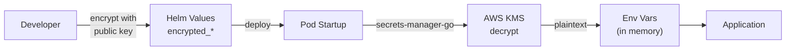

# Security

Security architecture for grafana-lgmt-proxy.

## Authentication Model

### Incoming Requests

The proxy does **not** authenticate incoming requests. It's designed to run inside a Kubernetes cluster where:
- Network policies restrict access to authorized namespaces
- Service mesh (if present) handles mTLS between services

### Outgoing Requests

The proxy injects Grafana Cloud credentials into outgoing requests:

```
Authorization: Basic base64({orgId}:{accessToken})
X-Scope-OrgID: {orgId}
```

**Code anchor:** `src/config.ts:57-60` - `getAuthHeader()`

## Secrets Management

### No Plaintext Secrets

Secrets are never stored in plaintext in:
- Git repository
- Kubernetes Secrets (directly)
- Environment variable files committed to git

### Encryption Flow



### secrets-manager-go

Binary copied into container at build time:

**Code anchor:** `Dockerfile:19`
```dockerfile
COPY --from=534042329084.dkr.ecr.us-east-1.amazonaws.com/infrastructure/secrets-manager-go:v2 \
  --chmod=755 /secrets-manager-go /bin/secrets-manager-go
```

### IRSA (IAM Roles for Service Accounts)

The proxy uses IRSA to access KMS for decryption:

1. ServiceAccount annotated with IAM role ARN
2. AWS SDK in secrets-manager-go uses IRSA credentials
3. Role has permission to decrypt with specific CMK

Required IAM permissions:
```json
{
  "Effect": "Allow",
  "Action": ["kms:Decrypt"],
  "Resource": ["arn:aws:kms:us-east-1:*:key/<cmk-id>"]
}
```

### KMS Customer Master Key

- **Type**: Asymmetric RSA_4096
- **Purpose**: Decrypt secrets at pod startup
- **Per-environment**: Separate CMK for dev/stage/prod

## Input Validation

### Configuration Validation

All environment variables validated at startup using Zod:

**Code anchor:** `src/config.ts:10-19`

- URLs must be valid format
- Org IDs must be non-empty strings
- Access token must be non-empty

### Request Validation

Requests are forwarded as-is to Grafana Cloud. The proxy does not validate request bodies because:
- Grafana Cloud handles validation
- Various content types (protobuf, JSON, etc.)
- Proxy is transparent by design

## Rate Limiting

The proxy does **not** implement rate limiting. Rate limiting is handled by:
- Grafana Cloud (per-tenant limits)
- Kubernetes resource limits (indirect)

## Error Handling

### No Sensitive Data in Errors

Error responses do not leak:
- Access tokens
- Internal paths
- Upstream endpoint details (beyond what Grafana Cloud returns)

### Logging

Logs exclude sensitive headers:

**Code anchor:** `src/server.ts:8-15` - Request logging configured via Pino

## Container Security

### Read-Only Filesystem

**Code anchor:** `deployment/grafana-lgmt-proxy/values.yaml:73-74`
```yaml
containerSecurityContext:
  readOnlyRootFilesystem: true
```

### Non-Root User

**Code anchor:** `Dockerfile:21`
```dockerfile
USER node
```

### No Privileged Access

Container runs without:
- Privileged mode
- Host networking
- Host PID namespace
- Capabilities escalation

## Network Security

### Ingress

- ClusterIP service (not exposed externally)
- Only accessible within Kubernetes cluster
- Recommended: Network policies to restrict source namespaces

### Egress

- HTTPS to Grafana Cloud endpoints (*.grafana.net)
- HTTPS to AWS KMS (for secrets decryption)

### Example Network Policy

```yaml
apiVersion: networking.k8s.io/v1
kind: NetworkPolicy
metadata:
  name: grafana-lgmt-proxy
spec:
  podSelector:
    matchLabels:
      app: grafana-lgmt-proxy
  policyTypes:
    - Ingress
    - Egress
  ingress:
    - from:
        - namespaceSelector:
            matchLabels:
              grafana-lgmt-proxy-access: "true"
      ports:
        - port: 8085
  egress:
    - to:
        - ipBlock:
            cidr: 0.0.0.0/0
      ports:
        - port: 443
```

## Audit Logging

### What's Logged

- All incoming requests (method, path, source IP)
- Response status codes
- Request duration
- Proxy destination

### What's NOT Logged

- Request/response bodies
- Authorization headers
- Access tokens

## Security Checklist

For deployments:

- [ ] IRSA configured with minimal KMS permissions
- [ ] Encrypted values in Helm (no plaintext tokens)
- [ ] Network policies restrict ingress to authorized namespaces
- [ ] Container runs as non-root with read-only filesystem
- [ ] Access token has minimal required scopes in Grafana Cloud
- [ ] Separate CMK per environment (dev/stage/prod)

## Incident Response

### Compromised Token

1. Revoke token in Grafana Cloud immediately
2. Generate new token with same scopes
3. Re-encrypt with secrets-manager-go
4. Update Helm values and redeploy
5. Audit logs for unauthorized access

### Pod Compromise

1. Delete compromised pod immediately
2. Check other pods in namespace
3. Rotate all secrets (token, CMK if needed)
4. Review IRSA permissions
5. Audit CloudTrail for KMS usage
